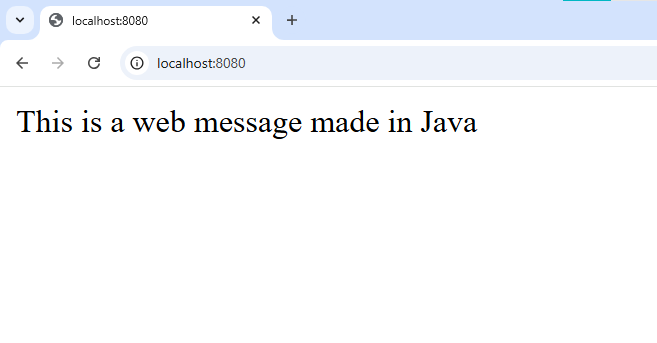

# Message whith JAVA
## Results

<p align="center">
    
</p>

This is a program that presents a message on the web with JAVA

## :open_book: Repository on Github
* Clone the repository

    ```
    git clone https://github.com/ciizao/3rd-Proyect-using-Docker.git
    ```

## :rocket: How to run in docker
### Pre-requisites
* Docker - DockerDesktop installed
* DockerHub account
### Download image
```
docker pull ciizao/3rd-proyect-using-docker-go
```
> [!IMPORTANT]
> By default, port 8080 is the one assigned to open the web page
### Run image
```
docker run --name <NEWCONTAINERNAME> -p 8080:8080 <IMAGENAME>
```
> [!TIP]
> The name of the downloaded image must match the one placed in the previous command, for this you can verify it using the **docker images** command. Additionally, you must check that there is no other container with the same name as the one placed in the command.
> [!TIP]
> Check if the port is not being used with the command: netstat -aon | findstr :8080
> If it is busy we can stop the process with the command: taskkill /PID <PID> /F

### View the results
Open new window browser and search localhost:8080

[View results](#results)

